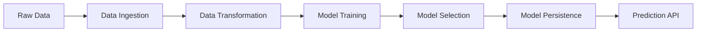

# � Semantic Autograder

[](https://python.org)
[](https://scikit-learn.org)
[](https://github.com/psf/black)
[](https://github.com/astral-sh/ruff)
[](https://github.com/pre-commit/pre-commit)
[](https://opensource.org/licenses/MIT)

> **Production-ready machine learning pipeline for student performance prediction with automated model selection, robust preprocessing, and streamlined deployment capabilities.**

## 🚀 Overview

Semantic Autograder is an enterprise-grade ML solution that predicts student mathematics performance using demographic and academic indicators. Built with industry best practices, it features automated hyperparameter tuning, comprehensive data validation, and production-ready artifact management.

**🎯 Key Value Propositions:**
- **Automated ML Pipeline**: End-to-end automation from raw data to production-ready models
- **Model Selection**: Intelligent comparison of multiple algorithms with hyperparameter optimization
- **Production Ready**: Serialized artifacts, robust error handling, and comprehensive logging
- **Developer Experience**: CLI tools, pre-commit hooks, and standardized project structure

## 🛠️ Technology Stack

| Component | Technology | Purpose |
|-----------|------------|---------|
| **ML Framework** | scikit-learn, pandas, numpy | Core ML operations and data manipulation |
| **Code Quality** | Black, Ruff, MyPy | Automated formatting, linting, and type checking |
| **Pipeline** | Custom Python modules | Modular, testable ML pipeline architecture |
| **CLI** | argparse | Production-grade command-line interface |
| **Development** | pre-commit, Makefile | Streamlined development workflow |

## ⚡ Quick Start

### Prerequisites
- Python 3.9+
- Virtual environment (recommended)

### Installation & Setup

```bash
# Clone and navigate to project
git clone <repository-url>
cd semantic_autograder

# Setup environment and dependencies
make install
```

### Training Pipeline

Execute the complete ML pipeline with a single command:

```bash
make train
```

**Pipeline Stages:**
1. **Data Ingestion** → CSV processing and train/test split
2. **Feature Engineering** → Automated preprocessing and encoding  
3. **Model Training** → Multi-algorithm comparison with hyperparameter tuning
4. **Model Selection** → Best performer selection based on R² score

**Generated Artifacts:**
```
artifacts/
├── data_ingestion/
│   ├── raw.csv           # Original dataset
│   ├── train.csv         # Training split (80%)
│   └── test.csv          # Testing split (20%)
├── data_transformation/
│   └── preprocessor.pkl  # Fitted preprocessing pipeline
└── model_trainer/
    └── model.pkl         # Best performing model
```

### Inference & Prediction

```bash
# CLI prediction interface
sa-predict --gender female \
           --race "group B" \
           --parental "bachelor's degree" \
           --lunch standard \
           --prep none \
           --reading 72 \
           --writing 74
# Output: 66.11 (predicted math score)
```

### Development Workflow

```bash
# Code formatting and quality checks
make format    # Black + Ruff formatting
make lint      # Static analysis and linting

# Pre-commit hooks (automatic on commit)
make precommit # Manual execution of all hooks
```

## 🏗️ Architecture

### Project Structure
```
src/
├── components/           # Core ML components
│   ├── data_ingestion.py        # ETL and data splitting
│   ├── data_transformation.py   # Feature engineering pipeline
│   └── model_training.py        # ML model training and selection
├── pipeline/            # End-to-end workflows
│   ├── train_pipeline.py        # Training orchestration
│   └── predict_pipeline.py      # Inference pipeline + CLI
└── utils/               # Shared utilities
    ├── exception.py             # Custom exception handling
    ├── logger.py                # Centralized logging
    └── utils.py                 # Helper functions
```

### ML Pipeline Design


## 🔧 Advanced Usage

### Custom Configuration
```python
from src.components.model_training import ModelTrainer, ModelTrainerConfig

# Custom artifact location
config = ModelTrainerConfig(
    artifacts_dir="custom/path",
    model_path="custom/path/model.pkl"
)
trainer = ModelTrainer(config)
```

### Programmatic API
```python
from src.pipeline.predict_pipeline import PredictPipeline, StudentData

# Initialize pipeline
pipeline = PredictPipeline()

# Create prediction input
student = StudentData(
    gender="female",
    race_ethnicity="group B",
    parental_level_of_education="bachelor's degree",
    lunch="standard", 
    test_preparation_course="none",
    reading_score=72.0,
    writing_score=74.0
)

# Generate prediction
prediction = pipeline.predict(student.to_df())
print(f"Predicted math score: {prediction[0]:.2f}")
```

## 📊 Model Performance

| Algorithm | R² Score | Training Time | Notes |
|-----------|----------|---------------|-------|
| **Linear Regression** | **0.8804** | ~0.1s | Best performer, interpretable |
| Gradient Boosting | 0.8683 | ~2.5s | Strong performance, feature importance |
| Random Forest | 0.8555 | ~1.8s | Robust, handles overfitting well |
| Decision Tree | 0.8242 | ~0.5s | Fast training, prone to overfitting |

## 🔍 Data Schema

| Feature | Type | Description | Example Values |
|---------|------|-------------|---------------|
| `gender` | Categorical | Student gender | `female`, `male` |
| `race_ethnicity` | Categorical | Ethnic background | `group A`, `group B`, `group C` |
| `parental_level_of_education` | Categorical | Parent education level | `bachelor's degree`, `some college` |
| `lunch` | Categorical | Lunch program participation | `standard`, `free/reduced` |
| `test_preparation_course` | Categorical | Test prep completion | `none`, `completed` |
| `reading_score` | Numeric | Reading assessment score | 0-100 |
| `writing_score` | Numeric | Writing assessment score | 0-100 |
| **`math_score`** | **Numeric** | **Target: Math assessment score** | **0-100** |

## 🚀 Production Deployment

### Package Installation
```bash
# Install as editable package
pip install -e .

# Available console commands
sa-train      # Execute training pipeline  
sa-predict    # Run inference CLI
```

### Docker Deployment
```dockerfile
FROM python:3.9-slim
WORKDIR /app
COPY requirements.txt .
RUN pip install -r requirements.txt
COPY . .
RUN pip install -e .
CMD ["sa-train"]
```

## 🤝 Contributing

We welcome contributions! This project follows industry-standard practices:

1. **Code Quality**: All code must pass Black formatting, Ruff linting, and MyPy type checking
2. **Testing**: Comprehensive test coverage for new features
3. **Documentation**: Clear docstrings and updated README for new functionality

```bash
# Development setup
make install
make precommit  # Verify all checks pass
```

## 📄 License

This project is licensed under the MIT License - see the [LICENSE](LICENSE) file for details.

---

